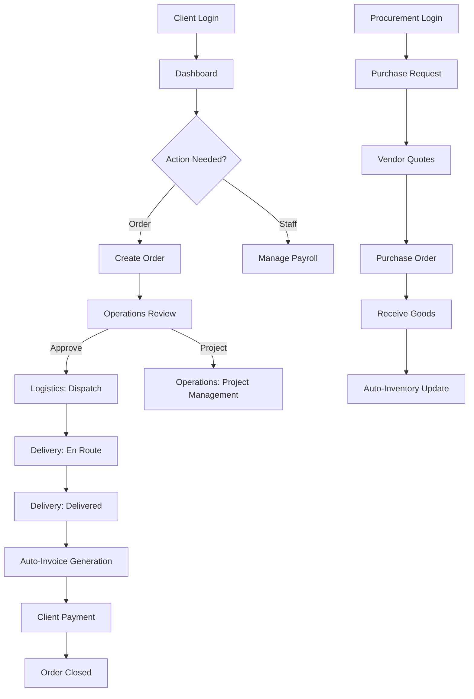

# ZaneZion — Backend Functional Flow & QA Architecture Report

**Status**: Final | **Version**: 1.0  
**Prepared by**: Antigravity (Senior Software Architect & QA Lead)

---

## 1. System Role Architecture
The system follows a **Multi-Tenant Role-Based Access Control (RBAC)** architecture. Every request (except Super Admin) is scoped by `company_id`.

| Role | Responsibility | Data Scope |
| :--- | :--- | :--- |
| **Client** | Business Owner | Full Company Access |
| **SaaS Client** | External Subscriber | Own Requests/Orders Only |
| **Operations** | Project & Order Management | Project/Order Lifecycle |
| **Procurement** | Purchasing & Vendor Management | Supply Chain & Inventory Inbound |
| **Logistics** | Fleet & Dispatch | Missions & Deliveries |
| **Inventory** | Warehouse Control | Stock levels & Movements |
| **Concierge** | Guest & VIP Services | Luxury Events & Guest Requests |
| **Staff** | Field Workforce | Personal Tasks & Attendance |

---

## 2. Role-Wise Functional Breakdown

### 2.1 Role: Client (Business Owner)
**Purpose**: Complete oversight and management of the company's operations, staff, and finances.

| Module | Purpose | Actions | API Endpoint(s) | Dependencies |
| :--- | :--- | :--- | :--- | :--- |
| **Dashboard** | Real-time business metrics | View Stats | `GET /api/dashboard/stats` | None |
| **Staff Management** | Employee lifecycle management | CRUD, Approve, Pay | `GET /api/staff`, `POST /api/auth/staff-review/:id` | Staff must register first |
| **Finance** | Revenue & Expense tracking | View Invoices, Pay | `GET /api/finance/invoices`, `POST /api/finance/invoices/:id/pay` | Delivery must be completed |
| **Settings** | Company profile & branding | Update Settings | `GET /api/settings`, `PUT /api/settings` | None |

---

### 2.2 Role: Procurement
**Purpose**: Managing the procurement cycle from purchase requests to inventory stocking.

| Module | Purpose | Actions | API Endpoint(s) | Input / Output |
| :--- | :--- | :--- | :--- | :--- |
| **Purchase Requests** | Internal item requests | Add, Edit, Delete, View | `POST /api/procurement/requests` | **In**: `item_name`, `qty`, `cost` / **Out**: `id` |
| **Vendor Quotes** | Price comparison | Add, View | `POST /api/procurement/quotes` | **In**: `vendor_id`, `items`, `total` / **Out**: `id` |
| **Purchase Orders** | Finalized orders to vendors | Create, Receive | `POST /api/procurement/po`, `PUT /api/procurement/po/:id/receive` | **In**: `receivedQty` / **Out**: Updates Inventory |
| **Vendors** | Supplier database | CRUD | `GET /api/vendors` | **In**: `name`, `contact` / **Out**: List |

---

### 2.3 Role: Operations
**Purpose**: Bridging Sales (Orders) and Execution (Projects/Missions).

| Module | Purpose | Actions | API Endpoint(s) | Dependencies |
| :--- | :--- | :--- | :--- | :--- |
| **Orders** | Client demand handling | Review, Convert | `GET /api/orders`, `POST /api/orders/convert/:id` | Requires Client submission |
| **Projects** | Long-term execution | CRUD, Track | `GET /api/orders/projects/all` | Usually converted from Order |
| **Missions** | Short-term field tasks | Launch, Assign | `POST /api/missions/convert/:orderId` | Requires Order |

---

### 2.4 Role: Logistics
**Purpose**: Managing the physical movement of goods and people.

| Module | Purpose | Actions | API Endpoint(s) | Logical Sequence |
| :--- | :--- | :--- | :--- | :--- |
| **Deliveries** | Goods transit tracking | Dispatch, Complete | `PATCH /api/logistics/deliveries/:id/status` | Dispatch → En Route → Delivered |
| **Fleet Management** | Vehicle tracking | CRUD | `GET /api/logistics/vehicles` | Add vehicle before dispatch |
| **Chauffeur** | VIP transport services | Create, Assign | `POST /api/logistics/deliveries` (type: Chauffeur) | Linked to Concierge requests |

---

### 2.5 Role: Inventory
**Purpose**: Maintaining stock levels and auditing movements.

| Module | Purpose | Actions | API Endpoint(s) | Logic |
| :--- | :--- | :--- | :--- | :--- |
| **Inventory** | Stock repository | CRUD, Adjust | `GET /api/inventory`, `POST /api/inventory/:id/adjust` | Manual or Auto (via PO) |
| **Warehouses** | Location management | CRUD | `GET /api/warehouses` | Link items to warehouse |
| **Audit Logs** | Movement history | View | `GET /api/inventory/movements` | Triggered by any adjustment |

---

### 2.6 Role: Concierge
**Purpose**: High-end hospitality and event management.

| Module | Purpose | Actions | API Endpoint(s) | Dependencies |
| :--- | :--- | :--- | :--- | :--- |
| **Events** | Event planning | CRUD | `POST /api/support/events` | None |
| **Guest Requests** | VIP personalized tasks | Add, Track | `POST /api/support/guest-requests` | Often links to Chauffeur |
| **Luxury Vault** | High-value item tracking | View, Issue | `GET /api/inventory` (filter: luxury) | None |

---

### 2.7 Role: Staff
**Purpose**: Operational workforce interaction.

| Module | Purpose | Actions | API Endpoint(s) | Sequence |
| :--- | :--- | :--- | :--- | :--- |
| **Terminal** | Attendance & Tasks | Clock In/Out | `POST /api/staff/clock-in`, `POST /api/staff/clock-out` | Must be Active status |
| **My Records** | Personal data | View Pay/Leave | `GET /api/staff/me` | None |

---

## 3. Core Business Logic Flow (Step-by-Step)

### 3.1 The "Order-to-Cash" Flow
1. **Client/SaaS Client**: Submits an Order via `POST /api/orders`.
2. **Operations**: Reviews Order and updates status to `approved`.
3. **Operations**: Clicks "Convert to Delivery/Mission".
   - System creates a Delivery record via `POST /api/logistics/deliveries`.
4. **Logistics**: Assigns a vehicle and driver. Updates status to `en_route`.
5. **Driver**: Completes delivery. Updates status to `delivered`.
6. **Finance (Auto)**: System detects `delivered` status and triggers `POST /api/finance/invoices`.
7. **Client**: Views Invoice and pays via `POST /api/finance/invoices/:id/pay`.
8. **System**: Marks Order as `completed`.

### 3.2 The "Procurement-to-Stock" Flow
1. **Staff/Dept**: Submits Purchase Request (PR).
2. **Procurement**: Reviews PR, creates Vendor Quote (Quote).
3. **Procurement**: Converts approved Quote/PR to Purchase Order (PO).
4. **Warehouse/Procurement**: Receives goods via `PUT /api/procurement/po/:id/receive`.
5. **System (Auto)**: Updates `inventory` quantities and creates `inventory_movements`.

---

## 4. Architecture Analysis: Gaps & Improvements

### 4.1 Logical Gaps
- **Missing Rejection Flows**: Many modules (like Quotes or Purchase Requests) have "Approval" logic but lack explicit "Rejection with Reason" handling in some controllers.
- **Price Mismatch**: In `receiveGoods`, if the received item price differs from the PO price, the system doesn't currently update the inventory unit price (weighted average cost is missing).
- **Hardcoded Thresholds**: Inventory "Low Stock" alerts are hardcoded (qty < 10) instead of being dynamic per item.

### 4.2 Inconsistent API Usage
- **Field Naming**: Some APIs use `vendor_id` (snake_case) while others accept `vendorId` (camelCase).
- **Response Structure**: Most controllers use `successResponse` helper, but some manual error returns exist which might break frontend error handling.

---

## 5. QA Testing Checklist

### 5.1 Functional Test Scenarios
| Module | Success Case | Failure Case | Edge Case |
| :--- | :--- | :--- | :--- |
| **Login** | Correct creds → Token + Menu | Wrong password → 401 | Pending Staff account login |
| **Orders** | Creation calculates total correctly | Zero quantity item | Converting order with $0 total |
| **PO Receipt** | Inventory increases by exact amount | Receiving more than ordered | Receiving item not in PO |
| **Clock In** | Valid shift created | Double clock-in without clock-out | Clock-out after 24+ hours |

### 5.2 API Security Tests
- [ ] **Bypass Company ID**: Try to GET an order from `company_id: 2` while logged in as `company_id: 1`. (Should fail with 403).
- [ ] **Role Escalation**: Try to access `POST /api/auth/staff-review` (Admin only) using a `staff` role token.
- [ ] **Payload Injection**: Send malicious JSON (missing fields or wrong types) to `POST /api/orders`.

---

## 6. Functional Flow Diagram (Text-Based)

---
**End of Report**
